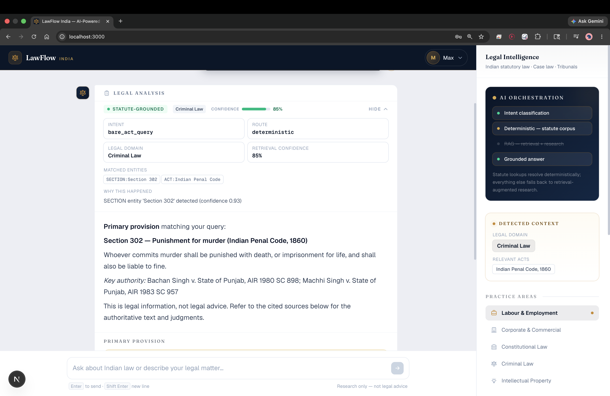
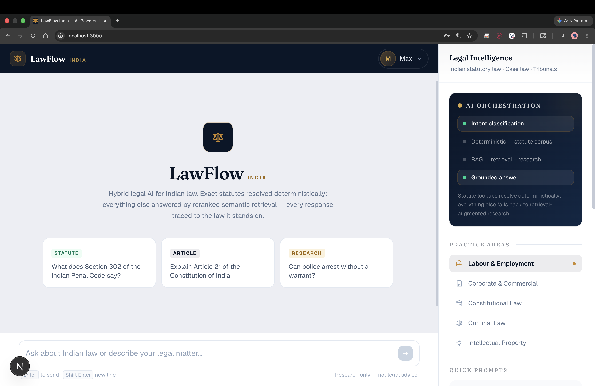
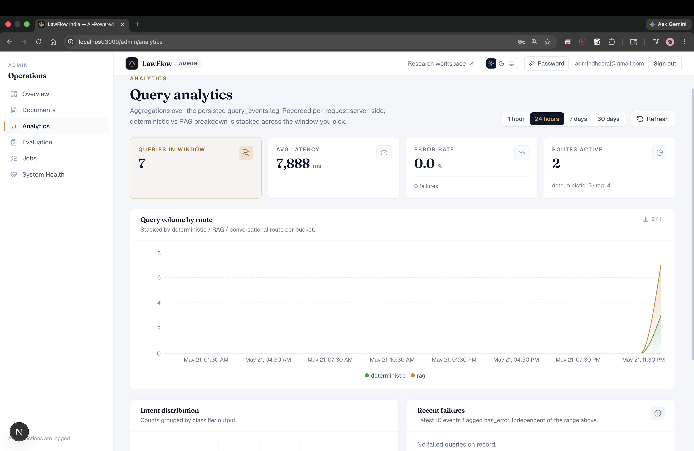
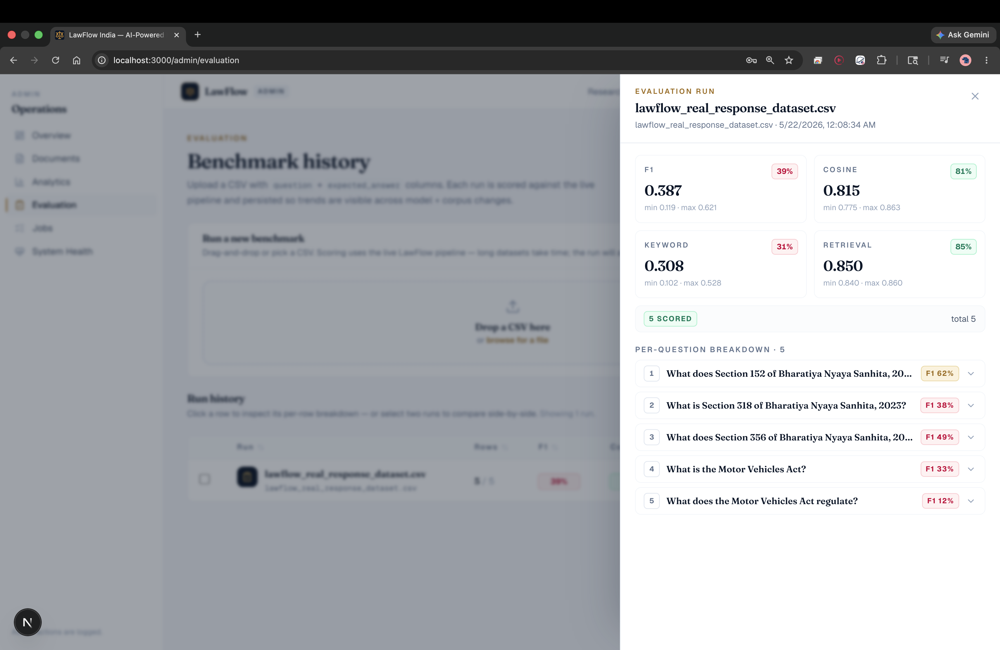
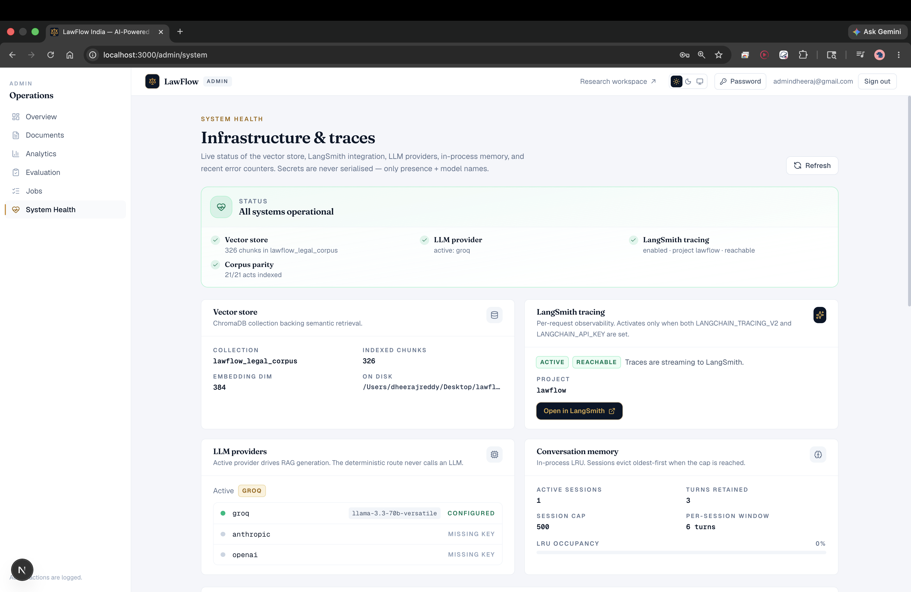
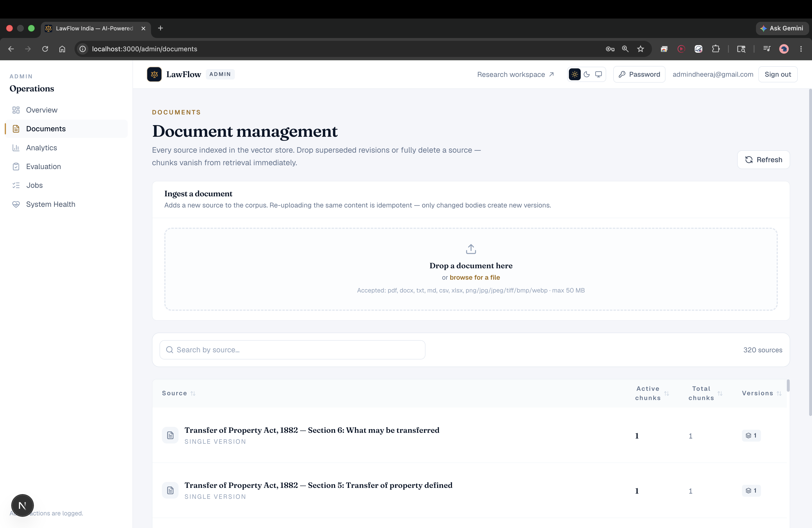

<div align="center">

# LawFlow

**An explainable, retrieval-grounded research assistant for Indian law.**

Hybrid BM25 + dense retrieval over 21 bare acts, cross-encoder reranking,
LangGraph orchestration, full audit trail, and a production-grade admin
console — all open source.

[Overview](#overview) · [Architecture](#architecture) · [Retrieval pipeline](#retrieval-pipeline) · [Explainability](#explainability) · [Evaluation](#evaluation) · [Admin platform](#admin-platform) · [Benchmarks](#benchmarks) · [Setup](#setup) · [Why LawFlow](#why-lawflow)

</div>

---

## Overview

LawFlow turns "what does the law actually say about X?" into an answer
you can trust. Every claim ships with the exact section it came from, a
retrieval breakdown you can inspect, and a confidence score derived
from the underlying retriever signals. No hallucinated citations, no
generic ChatGPT answers, no black-box agent traces.

- **Grounded.** Every sentence is tied to one or more chunks from the
  bundled corpus. The UI shows you which.
- **Hybrid retrieval.** BM25 + dense vectors fused with Reciprocal Rank
  Fusion, optionally reranked with a cross-encoder. **+12.5pp** on
  top-1 source match vs. a vector-only baseline.
- **Explainable.** A side panel exposes per-source overlap, retriever
  scores, the query rewrite that ran, and the route the query took
  through the graph.
- **Operational.** First-class admin console: corpus health, document
  ingestion, evaluation runs with diffable history, latency dashboards,
  audit log, and a background-job runner.

---

## Tech stack

| Layer        | Stack                                                                    |
| ------------ | ------------------------------------------------------------------------ |
| **Frontend** | Next.js 16 · React 19 · TypeScript · Tailwind v4 · Framer Motion · TanStack Table + Virtual · Recharts |
| **Backend**  | FastAPI · SQLAlchemy 2 (async) · Alembic · Pydantic v2 · LangChain · LangGraph |
| **AI / RAG** | BM25 (`rank-bm25`) · ChromaDB · `sentence-transformers` (BAAI/bge-small-en-v1.5) · BAAI/bge-reranker-base (cross-encoder, opt-in) · Groq / Anthropic / OpenAI providers · LangSmith tracing (opt-in) |
| **DevOps**   | GitHub Actions · Ruff · Pytest · pre-commit                              |

---

## Architecture

```
                ┌─────────────────────────────────────────────┐
                │              Next.js (App Router)           │
                │   Chat · Admin · Explainability · Charts    │
                └──────────────────────┬──────────────────────┘
                                       │  REST + SSE
                ┌──────────────────────▼──────────────────────┐
                │                FastAPI / Pydantic           │
                │  Auth · RBAC · Rate-limit · Audit · Jobs    │
                └──────────────────────┬──────────────────────┘
                                       │
                ┌──────────────────────▼──────────────────────┐
                │              LangGraph router               │
                │  greeting / definition / RAG / fallback     │
                └──────────────────────┬──────────────────────┘
                                       │  (RAG path)
                ┌──────────────────────▼──────────────────────┐
                │   Query rewrite → Hybrid retrieve → Rerank  │
                │   → Cross-encoder (opt) → Context assembly  │
                │   → LLM generation → Explainability trace   │
                └──────────────────────┬──────────────────────┘
                                       │
        ┌──────────────────────┬───────┴────────┬─────────────────────┐
        │                      │                │                     │
   ┌────▼─────┐           ┌────▼─────┐    ┌─────▼─────┐         ┌─────▼─────┐
   │ ChromaDB │           │  BM25    │    │  SQLite / │         │ LangSmith │
   │ (vectors)│           │ (lexical)│    │  Postgres │         │ (optional)│
   └──────────┘           └──────────┘    └───────────┘         └───────────┘
```

### Request flow

```
User query
  → LangGraph Router        (intent / route selection)
    → Query Rewriting       (synonym expansion, section-number normalisation)
      → Hybrid Retrieval
          ├── BM25
          ├── Vector Search (bge-small-en-v1.5)
          └── RRF Fusion    (weighted reciprocal rank fusion)
        → Reranking          (deterministic legal-signal rerank)
          → Cross-Encoder    (BAAI/bge-reranker-base — opt-in)
            → Context Assembly
              → LLM Generation     (Groq / Anthropic — configurable)
                → Explainability + Analytics
```

---

## Retrieval pipeline

LawFlow does not use a vanilla "embed → cosine-search → stuff into
prompt" RAG. The pipeline is six explicit stages, each instrumented
for the explainability panel:

1. **Query rewrite.** Expands `s302 IPC` → `Section 302 of the Indian
   Penal Code`, handles colloquial phrasings, and emits multiple
   variants for the retriever to consider.
2. **Hybrid retrieval.** Each variant is searched in parallel by:
   - **BM25** over the chunked corpus — lexical recall, catches exact
     section numbers and legal-term-of-art queries.
   - **Vector search** with `BAAI/bge-small-en-v1.5` against ChromaDB
     — semantic recall, handles paraphrases and natural-language asks.
3. **RRF fusion.** Results merged with weighted reciprocal rank fusion
   (`W_VECTOR=0.6`, `W_BM25=0.4`), with a configurable dedup penalty
   for chunks sharing source + section.
4. **Deterministic legal rerank.** Boosts chunks whose source name or
   section number is mentioned verbatim in the query. Stable, fast,
   no model load.
5. **Cross-encoder rerank (opt-in).** `BAAI/bge-reranker-base` scores
   the top-K (query, chunk) pairs. Adds ~280 MB on first use and
   ~30–80 ms per query in exchange for a measurable lift on ambiguous
   queries.
6. **Context assembly.** Token-budgeted context window that preserves
   section ordering and emits a structured trace for the
   explainability panel.

Every knob is exposed via env vars — see `backend/.env.example`, the
`RAG_*` block.

---

## Explainability

Every answer ships with a full retrieval trace, surfaced in a
collapsible side panel:

- **Route taken** through the LangGraph router (greeting / definition
  / RAG / fallback) — with the intent classifier's confidence.
- **Query rewrite** — the variants the retriever actually saw, not
  just the user's literal input.
- **Per-source signals** — for each retrieved chunk, the BM25 rank,
  vector rank, fused RRF score, rerank delta, and (when enabled)
  cross-encoder score.
- **Overlap & confidence** — token-level overlap between the answer
  and the cited chunks, plus a derived confidence score so the UI can
  flag low-evidence answers.
- **Advanced mode** — toggles to a raw JSON view for compliance,
  audit, or debugging.

The panel reads the same SSE meta event the backend emits to the audit
log, so what the user sees is exactly what the operator sees.

---

## Evaluation

A first-class evaluation harness sits alongside the retrieval code,
not bolted on:

- **Bundled benchmark.** `evaluations/legal_retrieval_v1.csv` — 16
  hand-curated Indian-statutory questions with expected source +
  section.
- **Metrics.** Top-1 source match (the headline number for legal
  retrieval), mean overlap @ K, mean latency, per-question deltas.
- **Diffable runs.** The admin console persists every run; the
  evaluation page diffs the active run against any prior one and
  highlights regressions per question.
- **CLI + UI parity.** `python backend/scripts/bench_retrieval.py`
  produces the same JSON the admin UI reads, so CI gates and human
  inspection share one source of truth.

Baseline vs. hybrid results live in
[`evaluations/baseline_vs_hybrid.json`](evaluations/baseline_vs_hybrid.json);
the headline numbers are in the [Benchmarks](#benchmarks) section
below.

---

## Admin platform

A complete operator UI, not just a settings page:

- **Documents.** Upload PDF / DOCX / XLSX / HTML / images. Image-only
  PDFs and scans go through RapidOCR. The section-aware chunker
  preserves act → chapter → section hierarchy. Every upload exposes
  chunk counts, freshness, and a re-ingest action.
- **Evaluation.** Trigger runs, drill into per-question deltas, diff
  against any prior run.
- **System.** Corpus status, latency / throughput charts, job queue
  health, retention windows, route mix.
- **Jobs.** A background executor with a stale-job reaper. Long
  operations (re-ingest, evaluation, retention sweeps) run here and
  surface progress in the UI.
- **Settings.** Feature flags, retention windows, LLM provider
  switching.
- **Auth.** JWT with refresh-cookie rotation, RBAC
  (`viewer` / `analyst` / `admin`), deterministic bootstrap-admin
  provisioning, full audit log.
- **Observability.** Optional LangSmith tracing captures every
  LangGraph node, retriever, reranker, and LLM call as a nested span —
  off by default for privacy.

---

## Benchmarks

Run on the bundled `evaluations/legal_retrieval_v1.csv` (16 questions,
top-K = 4). Full per-question deltas in
`evaluations/baseline_vs_hybrid.json`.

| Metric                  | Baseline (vector-only) | Hybrid (BM25 + vector + rerank) | Δ           |
| ----------------------- | ---------------------- | ------------------------------- | ----------- |
| **Top-1 source match**  | 62.5%                  | **75.0%**                       | **+12.5pp** |
| Mean overlap @ K=4      | 0.744                  | 0.746                           | +0.002      |
| Mean retrieval latency  | **17.5 ms**            | 33.0 ms                         | +15.6 ms    |

The headline win is **+12.5pp on top-1 source match** — hybrid finds
the right section (e.g. *IPC 302* vs. *BNS 103*) where vector-only
retrieval gets confused by paraphrastic neighbours. The latency cost
is ~16 ms; the cross-encoder rerank (off in the table above) adds
another 30–80 ms when enabled.

Reproduce with `python backend/scripts/bench_retrieval.py`.

---

## Screenshots

### Explainability — every answer's retrieval trace

Intent, route, confidence, detected entities, and the full AI-orchestration
chain that produced the answer. The "Why this answer?" line shows the
deciding signal.



### Chat — grounded conversational surface

Hybrid retrieval and reranked semantic search behind a deliberately
restrained chat UI. The right rail surfaces the route the query took and
the detected practice area.



### Analytics — query volume, latency, route mix

Server-side aggregations over the persisted `query_events` log:
deterministic vs RAG split, p50/p95/p99 latency, error rate, intent
distribution. Time windows of 1h / 24h / 7d / 30d.



### Evaluation — benchmark runs with per-question deltas

Upload a CSV, score it against the live pipeline, and drill into
per-question F1 / cosine / keyword / retrieval. Run history is
persisted so trends are visible across model and corpus changes.



### System health — corpus, vector store, providers, traces

Live status of the Chroma collection, BM25 index, LLM providers,
LangSmith integration, and conversational memory. All four health
checks visible at a glance.



### Documents — section-aware ingestion and re-ingest

Every source indexed in the vector store. Re-uploading the same content
is idempotent — only changed bodies create a new version, and the old
chunks are dropped from retrieval immediately.



See [`screenshots/README.md`](screenshots/README.md) for capture
guidelines.

---

## Setup

### Prerequisites

- Python 3.11+
- Node.js 20+
- macOS / Linux (Windows works via WSL)

### Backend

```bash
cd backend
python -m venv .venv && source .venv/bin/activate
pip install -r requirements.txt

cp .env.example .env
# Edit .env — at minimum set GROQ_API_KEY (or ANTHROPIC_API_KEY) and the
# BOOTSTRAP_ADMIN_* fields. Generate JWT_SECRET_KEY with:
#   python -c "import secrets; print(secrets.token_urlsafe(48))"

alembic upgrade head
uvicorn app.main:app --reload --port 8000
```

The first request triggers corpus ingestion into ChromaDB
(`chroma_db/`, gitignored). Subsequent runs reuse the persisted
vectors.

### Frontend

```bash
cd frontend
npm install
npm run dev    # http://localhost:3000
```

Log in with the bootstrap admin credentials, or sign up for a
viewer-role account.

### Tests

```bash
cd backend  && pytest
cd frontend && npm run lint
```

For day-2 operations — migrations, bootstrap admin, production env —
see [`OPERATIONS.md`](OPERATIONS.md).

---

## Why LawFlow

> Indian law is enormous, paraphrased to death online, and full of
> traps where the "obvious" section number is no longer the right one
> (IPC → BNS, CrPC → BNSS, IEA → BSA). A chatbot that hallucinates a
> section number is worse than no chatbot at all.

Most RAG demos stop at vector search. LawFlow exists because that's
not enough for this domain:

- **Citations are the product.** Every answer is anchored to a section
  in the bundled corpus — not a fuzzy memory inside a model. The
  explainability panel makes the retrieval trace inspectable, not
  hidden.
- **Hybrid retrieval matters here specifically.** Legal queries swing
  between exact section-number lookups (where BM25 dominates) and
  natural-language asks (where vector search dominates). Doing only
  one leaves measurable recall on the table — the benchmark above is
  the receipts.
- **The new codes broke vector-only RAG.** Models trained before 2023
  confuse IPC sections with BNS sections; pure vector retrieval picks
  the "closer" embedding, which is often the wrong code. Lexical
  retrieval + a deterministic legal-signal rerank fixes this without
  retraining.
- **Production matters as much as the model.** Auth, RBAC, audit log,
  evaluation harness, job queue, latency observability, type-safe API
  client, migrations — all in the repo, all in CI. This is what
  shipping the thing actually looks like.

---

## Repository layout

```
lawflow/
├── .github/workflows/        CI: ruff, pytest, type-check
├── backend/
│   ├── app/                  FastAPI service
│   │   ├── api/              v1 routes (auth, query, admin/*)
│   │   ├── auth/             JWT + RBAC + bootstrap admin
│   │   ├── data/acts/        21 bundled acts (JSON)
│   │   ├── evaluation/       benchmark harness
│   │   ├── graphs/           LangGraph orchestration
│   │   ├── integrations/lc/  LangChain wrappers (opt-in tracing)
│   │   ├── jobs/             background executor + handlers
│   │   ├── rag/              bm25, hybrid, rerank, cross_encoder, ...
│   │   └── services/         legal_service, act_registry, metrics, ...
│   ├── migrations/           Alembic
│   ├── scripts/              bench_retrieval, dump_openapi, ...
│   └── tests/                pytest suites
├── frontend/
│   ├── app/                  Next.js App Router
│   │   ├── admin/            documents · evaluation · system · settings · jobs
│   │   ├── components/       ChatMessage · ExplainabilityPanel · ...
│   │   └── lib/              auth + admin API clients
│   └── public/
├── evaluations/              benchmark CSVs + result JSON
├── screenshots/              README assets
├── scripts/                  scan_secrets.py
├── LICENSE
├── OPERATIONS.md             day-2: migrations, bootstrap, prod env
└── README.md
```

---

## Author

Built by **Dheeraj Reddy Thumma**
GitHub: [@dheerajreddy111](https://github.com/dheerajreddy111)

LawFlow started as an answer to a narrow question: *can a small open
RAG stack beat a general-purpose chatbot on Indian statutory lookups?*
The repository above is the long-form yes. Issues, PRs, and benchmark
contributions are welcome.

---

## License

[MIT](LICENSE).

<div align="center">

<sub>Built by <a href="https://github.com/dheerajreddy111">Dheeraj Reddy Thumma</a> · <a href="https://github.com/dheerajreddy111">@dheerajreddy111</a></sub>

</div>
